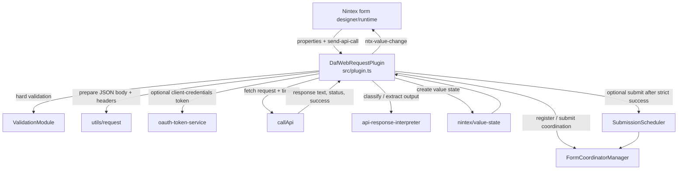
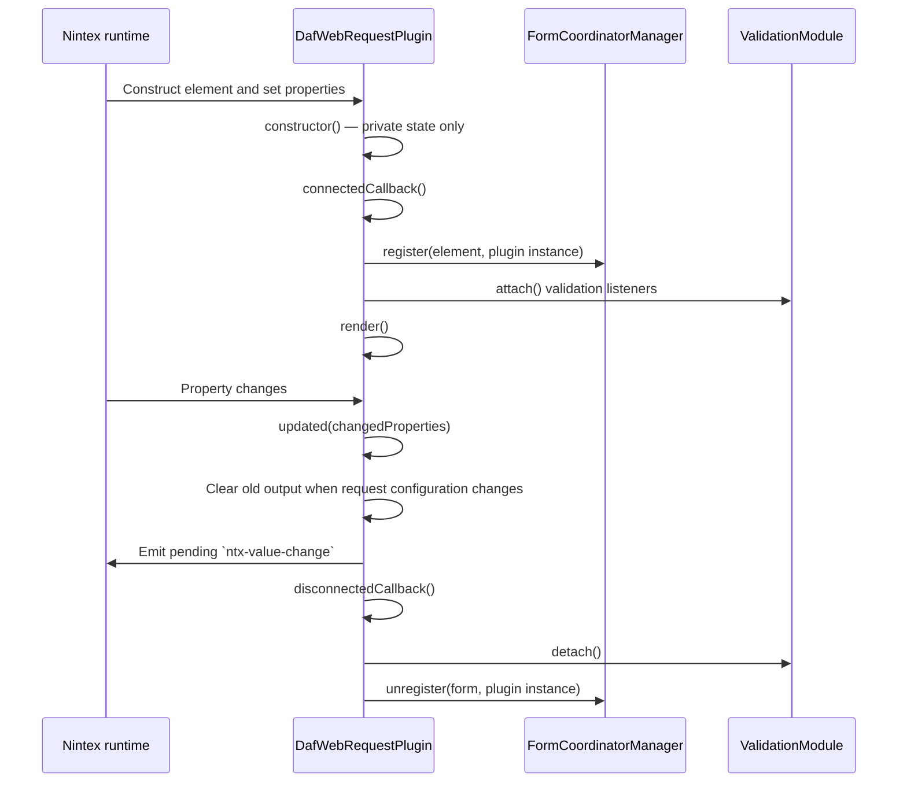
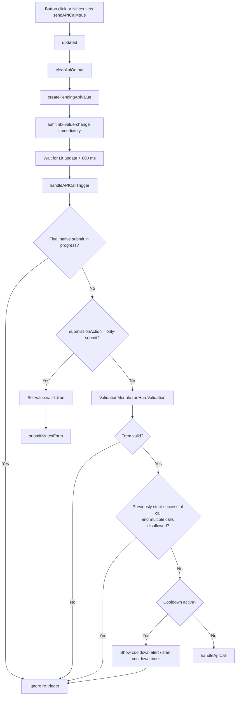
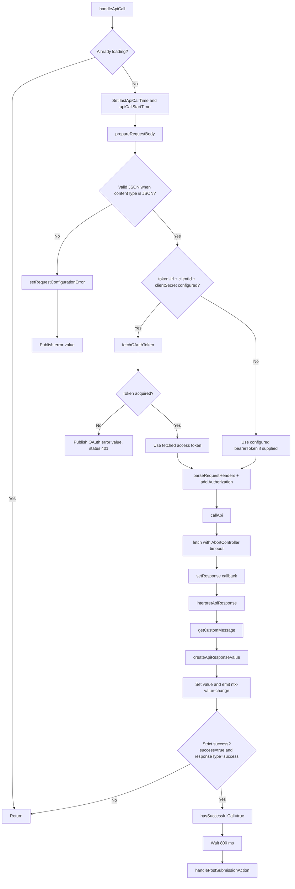
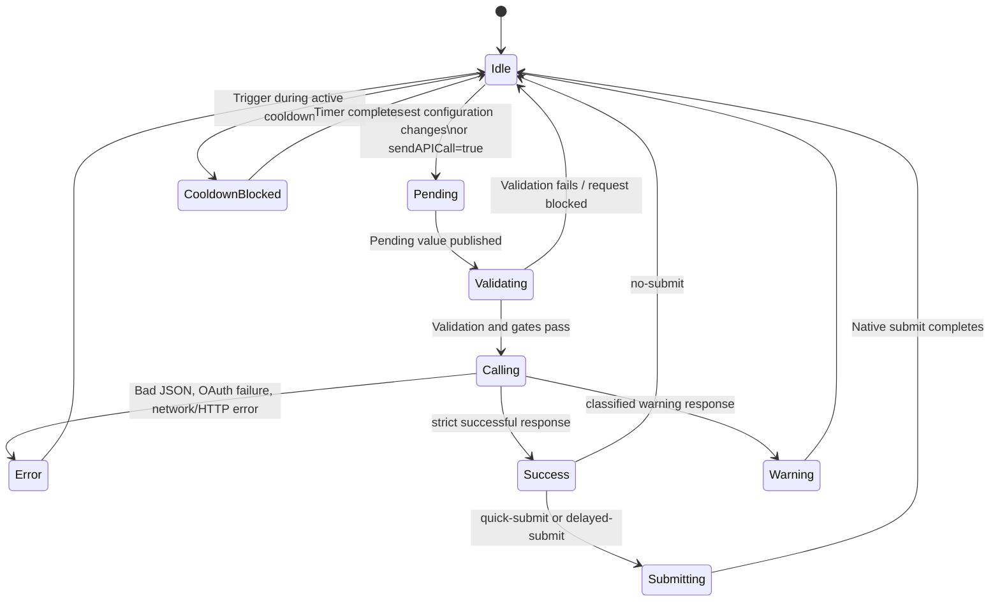
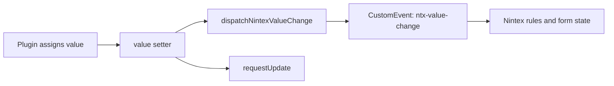
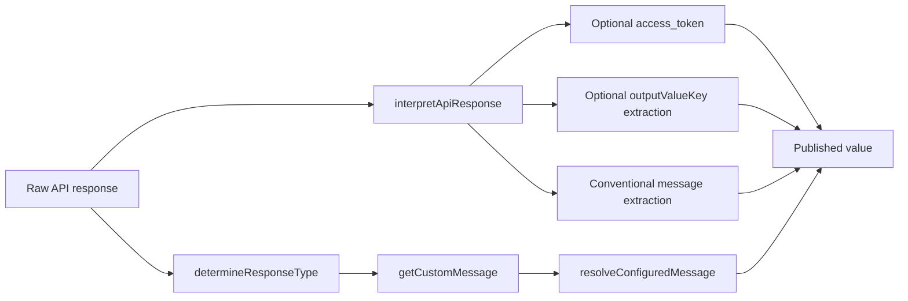

# DAF Web Request Plugin — Flow Explorer

This guide explains how the `daf-webrequest-plugin` works internally: how Nintex configuration reaches the component, how an API request is triggered and validated, how state changes are published, and how dependent modules participate in the flow.

> **Scope:** This is an implementation map for contributors and support engineers. It complements the main [README](../../README.md), which covers installation and configuration.

## Interactive map

Open [the interactive HTML flow map](index.html) in a browser for a click-through function tree and execution-path overview.


## Start here

- **Component entry point:** [`src/plugin.ts`](../../src/plugin.ts) — `DafWebRequestPlugin`
- **Nintex metadata:** [`src/nintex/plugin-contract.ts`](../../src/nintex/plugin-contract.ts) — `getPluginContract()`
- **Published output value:** [`src/nintex/value-state.ts`](../../src/nintex/value-state.ts)
- **HTTP transport:** [`src/apiClient.ts`](../../src/apiClient.ts)

## Architectural overview



## Lifecycle and form integration



### Lifecycle responsibilities

| Method | Responsibility |
| --- | --- |
| `constructor()` | Leaves Nintex-bound `@property` values alone; initializes only private state through field initializers. |
| `connectedCallback()` | Finds/registers the containing `<form>`, attaches validation behavior, and calls Lit's parent lifecycle. |
| `updated(changedProperties)` | Detects request-definition changes or a new `sendAPICall` trigger, clears stale output, publishes a pending result, and applies submit-button visibility changes. |
| `disconnectedCallback()` | Disposes timers, detaches validation, unregisters from form coordination, and removes injected error-suppression style when no longer needed. |

## Request execution flow

A request starts in either of two ways:

1. The rendered button calls `triggerAPICall()`, which sets `sendAPICall = true`.
2. A Nintex rule/property update sets the `send-api-call` attribute/property to `true`.

Setting the property is intentional: `updated()` is the single place that starts the request pipeline after publishing a pending value.



### `handleApiCall()` pipeline



## State model

The component uses Lit `@property` fields for Nintex inputs and private fields for execution/UI state. The `value` property is the boundary exposed back to Nintex.



### Important execution state

| Field | Meaning | Set/reset by |
| --- | --- | --- |
| `isLoading` | An API request is currently in flight; drives button disabled/loading UI. | `callApi()` callbacks |
| `apiResponse` | Raw response text or locally generated error text. | `setResponse`, error paths, `clearApiOutput()` |
| `responseType` | `success`, `warning`, `error`, or `null` before a response. | Response classification and error paths |
| `hasSuccessfulCall` | True only after a **strict success**; blocks another request when `allowMultipleAPICalls` is false. | `handleApiCall()`, `clearApiOutput()` |
| `lastApiCallTime` | Request start timestamp used for cooldown checks. | `handleApiCall()` |
| `showCooldownAlert` | Controls cooldown warning UI. | Trigger gate and `SubmissionScheduler` callback |
| `apiCallStartTime` | Baseline for `executionTime` in the outgoing value. | `handleApiCall()` |
| `isFinalizingSubmission` | Prevents a Nintex submission from re-entering the request pipeline. | `submitNintexForm()` / coordinator completion callback |
| `formatterJsonInput` / formatter fields | Debug-only response formatter editing state. | Debug formatter UI and API response handling |

## Configuration inputs and effects

### Request definition

These property changes clear any earlier result and publish a pending value so Nintex rules cannot accidentally evaluate stale data:

- `allowMultipleAPICalls`
- `apiUrl`, `method`, `requestBody`, `requestHeaders`
- `bearerToken`, `tokenUrl`, `clientId`, `clientSecret`
- `contentType`, `outputValueKey`, `requestTimeout`

| Input | Used by | Effect |
| --- | --- | --- |
| `apiUrl`, `method`, `requestHeaders`, `requestBody`, `contentType`, `requestTimeout` | `prepareRequestBody()`, `parseRequestHeaders()`, `callApi()` | Defines the outbound request and timeout. |
| `bearerToken` | `handleApiCall()` | Used as the Authorization bearer token unless OAuth obtains a replacement token. |
| `tokenUrl`, `clientId`, `clientSecret` | `fetchOAuthToken()` | Enables OAuth client-credentials token acquisition before the API call. |
| `outputValueKey` | `interpretApiResponse()` | Extracts nested JSON data into `value.output`. |
| `successMessage`, `warningMessage`, `errorMessage` | `getCustomMessage()` and UI | Supplies plain or configured response messages. |
| `sendAPICall` | `updated()` | Starts the request flow when changed to `true`; the plugin resets it to `false` before validation. |
| `allowMultipleAPICalls`, `countdownEnabled`, `countdownTimer` | `handleAPICallTrigger()` / `SubmissionScheduler` | Controls replay blocking and cooldown behavior. |
| `submissionAction` | `handleAPICallTrigger()` / `SubmissionScheduler` | Chooses whether and when a successful call submits the Nintex form. |
| `submitHidden` | `FormCoordinatorManager` | Hides/show the native submit button for the containing form. |
| `debugMode` | `render()` | Displays request/response, JSON, and formatter tooling. |

## Published Nintex value

Every assignment to `plugin.value` immediately dispatches a bubbling, composed `ntx-value-change` event. The event payload is the value object itself.



| Field | Meaning |
| --- | --- |
| `success` | `true` only when transport says success **and** the response classifier returns `success`. |
| `valid` | Mirrors strict success for API results. `only-submit` sets it to `true` without making an API call. |
| `statusCode` | HTTP status when available; `0` for local configuration/pending errors. |
| `responseType` | `pending`, `success`, `warning`, or `error`. |
| `data` | Raw response text or generated error message. |
| `message` | Extracted response message (`d.Message`, `Message`, `message`, `msg`, or `data.message`) when JSON. |
| `formattedResponse` | The configured or default display message. |
| `timestamp`, `executionTime` | When the value was created and how long the request path took. |
| `access_token` | Included only when the interpreted API JSON contains `access_token`. |
| `output` | Included only when `outputValueKey` resolves to a value in JSON output. |

### Value variants

| Situation | Factory / path | Key characteristics |
| --- | --- | --- |
| Configuration changed or request triggered | `createPendingApiValue()` | `valid: false`, `responseType: pending`, empty data. |
| Invalid JSON request body | `createConfigurationErrorValue()` | Local error, `statusCode: 0`, `responseType: error`. |
| OAuth failure | Inline error value in `handleApiCall()` | `statusCode: 401`, `responseType: error`. |
| API response | `createApiResponseValue()` | Includes status, classified type, raw data, formatted message, and optional extracted fields. |

## Response classification and message formatting



- `determineResponseType()` provides the initial result type; a failed transport forces `error`.
- `interpretApiResponse()` safely parses JSON if possible, extracts `access_token`, `outputValueKey`, and a common message field.
- `getCustomMessage()` supports configured response formatting and falls back to the message properties.
- The debug formatter uses `formatters/response-config.ts`, `field-selection.ts`, and `configured-message.ts` to create or preview formatting configuration; it does not alter transport execution.

## Form submission behavior

The plugin registers each instance with `FormCoordinatorManager`, which coordinates the native form submit listener across all DAF controls in a single form.

| `submissionAction` | Behavior |
| --- | --- |
| `no-submit` | A strict-successful API call publishes its output and leaves the form on screen. |
| `quick-submit` | After strict success and the value-processing delay, schedules native submission after 500 ms. |
| `delayed-submit` | After strict success, counts down using `countdownTimer`, updating the UI every 100 ms, then submits. |
| `only-submit` | Does not call the API. It marks `value.valid = true` and proxies the native form submit. |

`FormCoordinatorManager.submit()` temporarily permits native submission, clicks the form’s submit button, then removes that permission after 1.5 seconds. `isFinalizingSubmission` prevents the resulting form activity from triggering another API request.

## Module dependency map

| Module | Called by the plugin | Responsibility |
| --- | --- | --- |
| [`apiClient.ts`](../../src/apiClient.ts) | `callApi()` | Executes `fetch`, serializes request bodies, handles AbortController timeout, returns response through callbacks. |
| [`validation.module.ts`](../../src/validation.module.ts) | `ValidationModule` | Triggers and inspects Nintex validation before a request. |
| [`forms/form-coordinator.ts`](../../src/forms/form-coordinator.ts) | `FormCoordinatorManager` | Shares submit interception/button visibility across plugin instances in one form. |
| [`forms/submission-scheduler.ts`](../../src/forms/submission-scheduler.ts) | `SubmissionScheduler` | Owns cooldown and delayed-submit timers. |
| [`services/oauth-token-service.ts`](../../src/services/oauth-token-service.ts) | `fetchOAuthToken()` | Fetches OAuth client-credentials token with timeout and returns sanitised debug metadata. |
| [`services/api-response-interpreter.ts`](../../src/services/api-response-interpreter.ts) | `interpretApiResponse()` | Classifies/extracts response data. |
| [`nintex/value-state.ts`](../../src/nintex/value-state.ts) | Value factories | Creates consistent pending, error, and completed output shapes. |
| [`utils/request.ts`](../../src/utils/request.ts) | Request utilities | Validates/prepares request bodies and parses configured headers. |
| [`utils/response.ts`](../../src/utils/response.ts) | Response utilities | Determines response type and resolves nested values. |
| [`debug/*`](../../src/debug) | Render helpers | Renders debug tabs; does not own API execution state. |

## Troubleshooting by flow stage

| Symptom | Inspect first | Likely flow stage |
| --- | --- | --- |
| Request never starts | `sendAPICall`, `submissionAction`, validation errors | Trigger/validation gate |
| Button says cooldown or does nothing after success | `allowMultipleAPICalls`, `countdownEnabled`, `countdownTimer`, `hasSuccessfulCall` | Replay/cooldown gate |
| OAuth error | `tokenUrl`, `clientId`, `clientSecret`, `requestTimeout` | Token acquisition |
| Request body error before network activity | `contentType`, `requestBody` | `prepareRequestBody()` |
| API returns a response but output rule has no value | `outputValueKey`, parsed JSON response, `ntx-value-change` handling | Response interpretation/value publication |
| Form submits more than once or re-triggers an API call | `submissionAction`, `isFinalizingSubmission`, form coordinator logs | Submission coordination |

## Reading the code in order

For a concise code walkthrough, follow this order:

1. [`getPluginContract()`](../../src/nintex/plugin-contract.ts) — see the public Nintex configuration contract.
2. [`DafWebRequestPlugin` fields and `value` setter](../../src/plugin.ts) — see inputs, internal state, and event publication.
3. `connectedCallback()` and `updated()` — see form registration and trigger/reset behavior.
4. `handleAPICallTrigger()` — see validation, replay, cooldown, and submission gates.
5. `handleApiCall()` — see body preparation, OAuth, HTTP execution, response interpretation, and publication.
6. [`SubmissionScheduler`](../../src/forms/submission-scheduler.ts) and [`FormCoordinatorManager`](../../src/forms/form-coordinator.ts) — see post-success form submission.

## Keeping this explorer current

Update this document when you change any of these areas:

- A new Nintex property or output field
- The `sendAPICall` trigger behavior
- Validation, cooldown, or multiple-call gates
- OAuth or HTTP request construction
- Response classification or published value semantics
- `submissionAction` modes or form coordination

A useful validation command before documenting behavior changes is:

```sh
npm test
npm run typecheck
```
